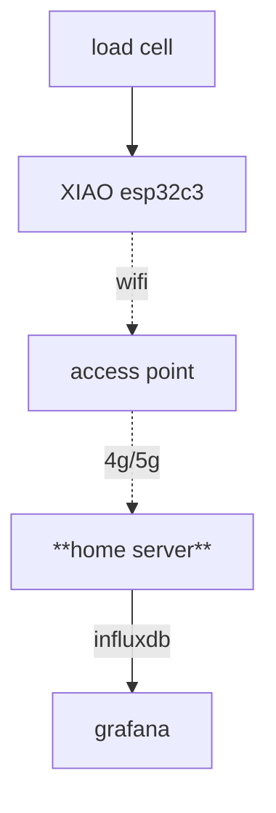

  ### beach weather probe
  Use a kite to measure **wind force**, instead of using anemometer.

-----
### 📜️ how it works

```mermaid
flowchart TB
    A[load cell] --> B[XIAO esp32c3]
    B -.->|wifi| C[access point]
    C -.->|4g/5g| D[**home server**]
    D -->|influxdb| E[grafana]
```

### screenshots